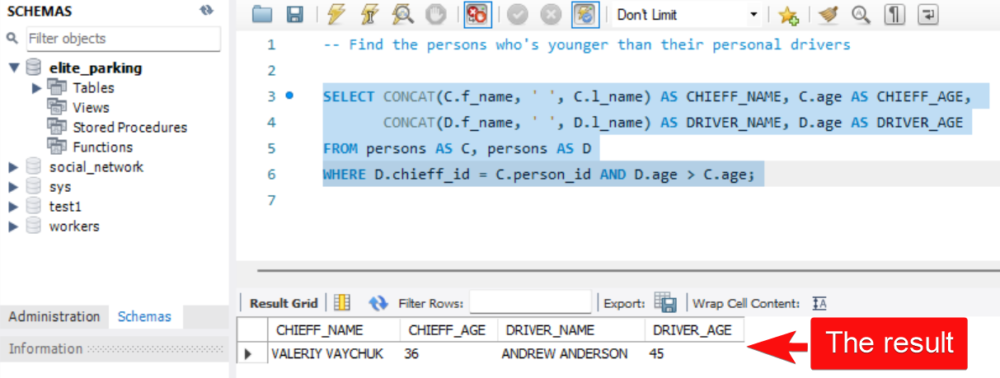

# Task 1: Using SELF JOIN and CONCAT

## Condition of the task:
Find the persons who's younger than their personal drivers 

## Schema of the database:
 

## Solution of the task: 

```SQL
SELECT CONCAT(C.f_name, ' ', C.l_name) AS CHIEFF_NAME, C.age AS CHIEFF_AGE, 
       CONCAT(D.f_name, ' ', D.l_name) AS DRIVER_NAME, D.age AS DRIVER_AGE
FROM persons AS C, persons AS D
WHERE D.chieff_id = C.person_id AND D.age > C.age;
```

