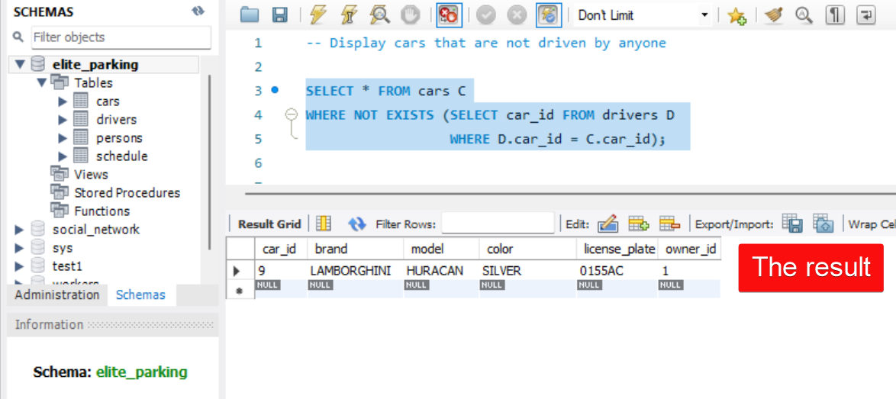
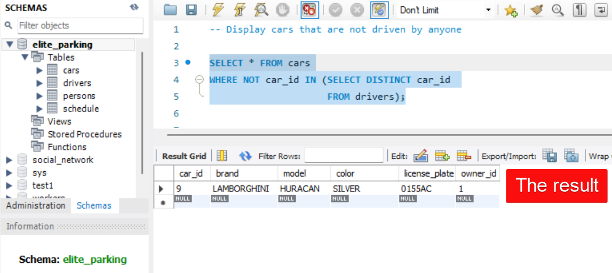

# Task 2: Using SUBQUERIES, EXISTS and DISTINCT

## Condition of the task:
Display cars that are not driven by anyone (solve it in several ways).

## Schema of the database:
 

## First possible solution of the task by ***correlated*** subquery: 

```SQL
SELECT * FROM cars C
WHERE NOT EXISTS (SELECT car_id FROM drivers D 
		  WHERE D.car_id = C.car_id);
```


___

## Second possible solution of the task by ***multiple*** subquery:

```SQL
SELECT * FROM cars
WHERE NOT car_id IN (SELECT DISTINCT car_id 
		     FROM drivers);
```


