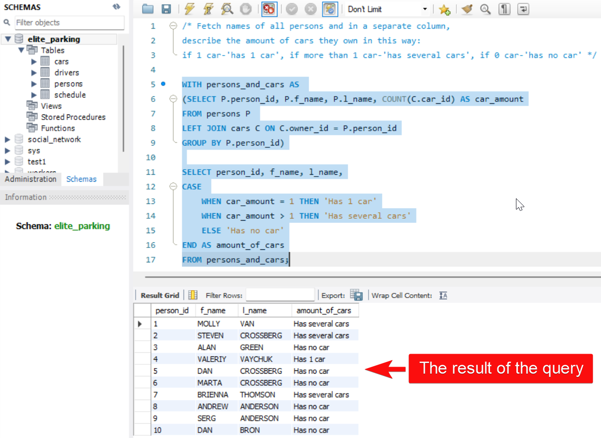

# Task 3: Using LEFT JOIN, COUNT, GROUP BY, WITH, CASE

## Condition of the task:
Fetch names of all persons and in a separate column, describe the amount of cars they own in this way:    
if 1 car - '**has 1 car**', if more than 1 car - '**has several cars**', if 0 car - '**has no car**' 

## Schema of the database:
 

## Solution of the task: 

```SQL
WITH persons_and_cars AS 
(SELECT P.person_id, P.f_name, P.l_name, COUNT(C.car_id) AS car_amount
FROM persons P 
LEFT JOIN cars C ON C.owner_id = P.person_id
GROUP BY P.person_id)

SELECT person_id, f_name, l_name,
CASE 
    WHEN car_amount = 1 THEN 'Has 1 car'
    WHEN car_amount > 1 THEN 'Has several cars'
    ELSE 'Has no car'
END AS amount_of_cars
FROM persons_and_cars;
```


