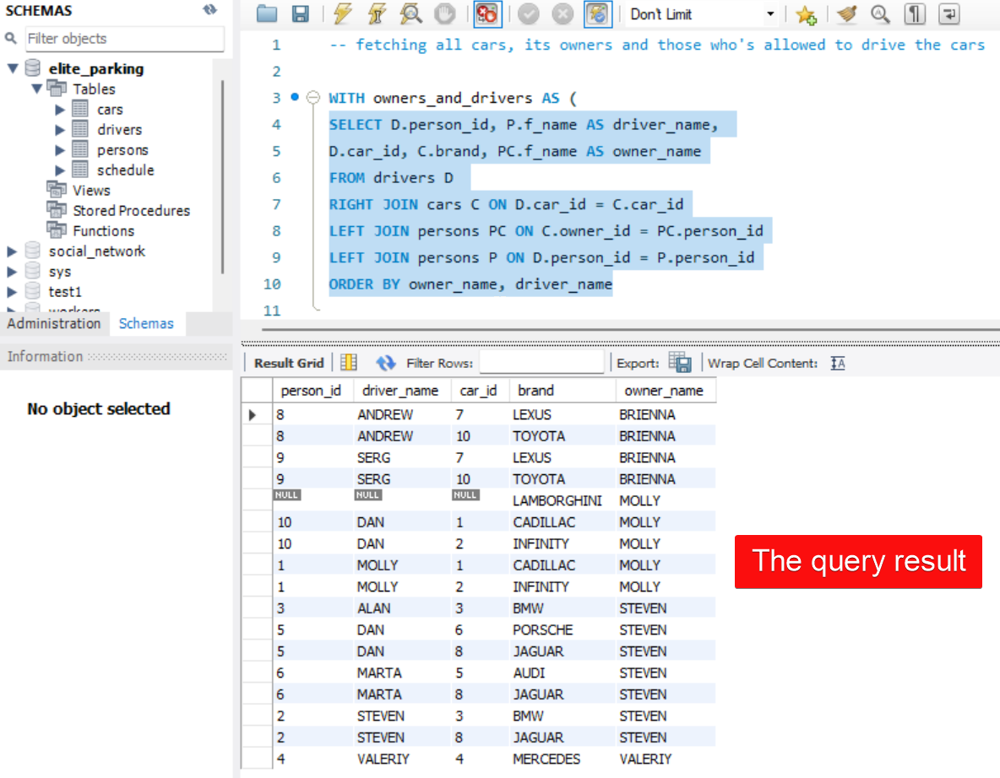
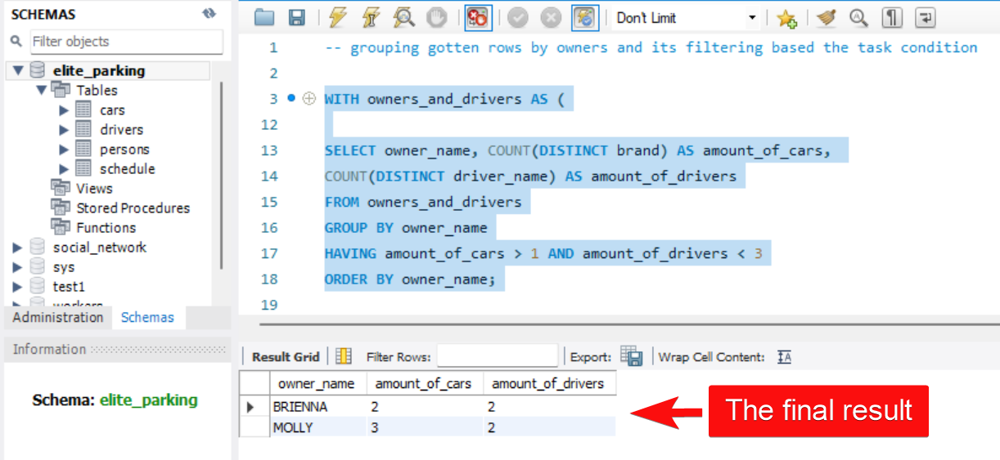

# Task 4: Using JOINs, COUNT, HAVING, GROUP BY, ORDER BY

## Condition of the task:
Define all car owners, who owns more than 1 car and their cars are used by less than 3 drivers. 

## Schema of the database:
 

## Solution of the task:
***note***: In this case, for more understandable the task solution will be presented in 2 steps.

### The first step: fetching all cars, its owners and those who's allowed to drive the cars

``` SQL
SELECT D.person_id, P.f_name AS driver_name, 
       D.car_id, C.brand, PC.f_name AS owner_name
FROM drivers D 
RIGHT JOIN cars C ON D.car_id = C.car_id
LEFT JOIN persons PC ON C.owner_id = PC.person_id
LEFT JOIN persons P ON D.person_id = P.person_id
ORDER BY owner_name, driver_name
```


___
### The second step: grouping gotten rows by owners and its filtering based the task condition

``` SQL
WITH owners_and_drivers AS (
SELECT D.person_id, P.f_name AS driver_name, 
       D.car_id, C.brand, PC.f_name AS owner_name
FROM drivers D 
RIGHT JOIN cars C ON D.car_id = C.car_id
LEFT JOIN persons PC ON C.owner_id = PC.person_id
LEFT JOIN persons P ON D.person_id = P.person_id
ORDER BY owner_name, driver_name)

SELECT owner_name, COUNT(DISTINCT brand) AS amount_of_cars, 
       COUNT(DISTINCT driver_name) AS amount_of_drivers
FROM owners_and_drivers
GROUP BY owner_name
HAVING amount_of_cars > 1 AND amount_of_drivers < 3
ORDER BY owner_name;
```


***note***: on a picture above, for a better view the query from the WITH-clause (step 1), has been collapsed
