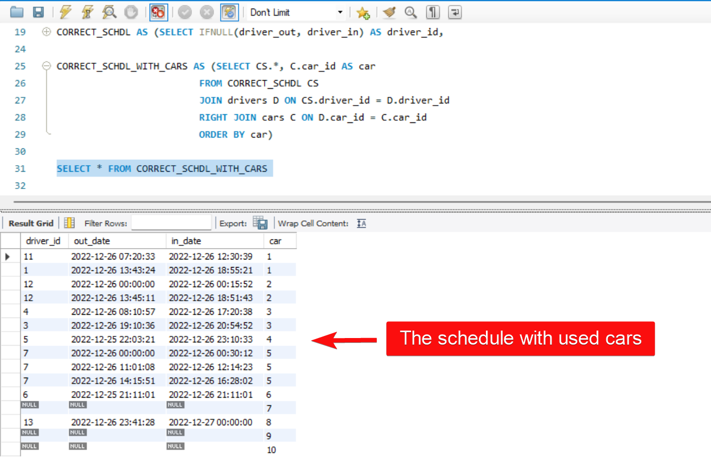

# Task 5: Using UNION, ROW_NUMBER, IFNULL, TIMESTAMPDIFF

## Condition of the task:
Write a query to find out how long each automobile from the Cars table was used based on the schedule table (i.e. was not parked).

## Schema of the database:
 

## Solution of the task:
***note***: As the task is not simple its possible solution will take around a dozen steps which will be displayed separately below to better clarify and every step but the last one will be injected into WITH clause

### The first step: Separating the Schedule table on two different by events 

#### ***move out*** events  

```SQL
SELECT schedule_id AS sch_out, driver_id AS driver_out, date AS out_date 
FROM schedule
WHERE event = "move out"
```


#### ***move in*** events 

```SQL
SELECT schedule_id AS sch_in, driver_id AS driver_in, date AS in_date 
FROM schedule
WHERE event = "move in"
```


___

### The second step: merging the step one tables into new one by ***full outer join*** 

```SQL
SELECT sch_out, driver_out, out_date, sch_in, driver_in, in_date
FROM MOVE_OUT
RIGHT JOIN MOVE_IN B ON driver_out = driver_in AND out_date < in_date
UNION
SELECT sch_out, driver_out, out_date, sch_in, driver_in, in_date
FROM MOVE_OUT
LEFT JOIN MOVE_IN B ON driver_out = driver_in AND out_date < in_date 
ORDER BY out_date
```


___

### The third step: defining if there are a wrong (duplicate) rows by ***row_number*** function 

```SQL
SELECT S.*,
ROW_NUMBER() 
OVER (PARTITION BY sch_out ORDER BY out_date) AS row_num
FROM SCHDL S
```


___

### The fourth step: cleaning the table from a wrong rows

```SQL
SELECT * FROM SCHDL_WITH_ROWS_NUM
WHERE row_num = 1 OR out_date IS NULL
```


___

### The fifth step: filling empty fields with data to prepare the table for following calculation   

```SQL
SELECT IFNULL(driver_out, driver_in) AS driver_id, 
       IFNULL(out_date, DATE(in_date)) AS out_date, 
       IFNULL(in_date, ADDDATE(DATE(out_date), INTERVAL 1 DAY)) AS in_date 
FROM SCHDL_WITHOUT_DUPLICATES
ORDER BY out_date
```


___

### The sixth step: displaying all cars which was being used by each driver and an untouched cars   

```SQL
SELECT CS.*, C.car_id AS car
FROM CORRECT_SCHDL CS
JOIN drivers D ON CS.driver_id = D.driver_id
RIGHT JOIN cars C ON D.car_id = C.car_id
ORDER BY car
```



___

### The seventh step: figuring out of how long each driver was using a car   

```SQL
SELECT driver_id, car, out_date, in_date, 
       TIMESTAMPDIFF(MINUTE, out_date, in_date) AS USED_TIME
FROM CORRECT_SCHDL_WITH_CARS
```


___

### The eighth step: figuring out how long each car was being used by their drivers   

```SQL
SELECT car, IFNULL(SUM(USED_TIME), 0) AS WHOLE_USED_TIME 
FROM DRIVERS_WITH_TIME
GROUP BY car
ORDER BY car
```


___

### The nineth step: splitting the usage time into hours and minutes   

```SQL
SELECT car, WHOLE_USED_TIME, FLOOR(WHOLE_USED_TIME/60) AS HOURS, 
       WHOLE_USED_TIME - FLOOR(WHOLE_USED_TIME/60)*60 AS MINUTES
FROM CARS_WITH_TIME
ORDER BY car
```


___

### The last step: adding to the final task solution a column for comments   

```SQL
SELECT car, HOURS, MINUTES,
CASE WHEN HOURS > 0 AND HOURS < 24  THEN " "
     WHEN HOURS = 24 AND MINUTES = 0 THEN "the car was used for one day"
     WHEN HOURS = 24 AND MINUTES > 0 THEN "the car was used for more than a day"
     WHEN HOURS > 24 THEN "the car was used for more than a day"
     WHEN HOURS = 0 AND MINUTES > 0 THEN "the car was used for less than an hour"
     ELSE "the car wasn't used yet"
END AS COMMENTARY 
FROM USED_TIME
```


